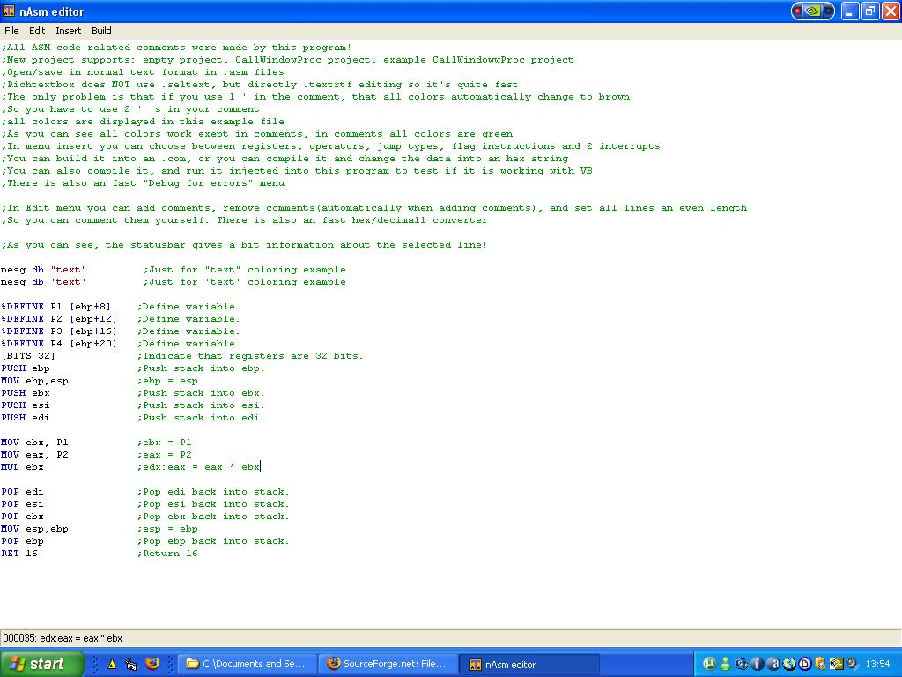



## nASM asm editor with text coloring

### Description

With this program you can easily edit ASM scripts it supports fast text coloring using .textRTF, test with VB using CallWindowProc function, Compiling into an hex-string constant(so you can use it in VB), Compiling to COM, Checking for errors using nasmw.exe . This project includes an example ASM script + an example ASM in VB project (YOU NEED TO DOWNLOAD NASM COMPILER TO USE COMPILING)
 
### More Info
 

             |
---                |---
**Submitted On**   |2007-03-31 13:54:58
**By**             |[Aston Flapper](https://github.com/Planet-Source-Code/PSCIndex/blob/master/ByAuthor/aston-flapper.md)
**Level**          |Intermediate
**User Rating**    |5.0 (20 globes from 4 users)
**Compatibility**  |VB 6\.0
**Category**       |[VB function enhancement](https://github.com/Planet-Source-Code/PSCIndex/blob/master/ByCategory/vb-function-enhancement__1-25.md)
**World**          |[Visual Basic](https://github.com/Planet-Source-Code/PSCIndex/blob/master/ByWorld/visual-basic.md)
**Archive File**   |[nASM\_asm\_e205763412007\.zip](https://github.com/Planet-Source-Code/aston-flapper-nasm-asm-editor-with-text-coloring__1-68249/archive/master.zip)

